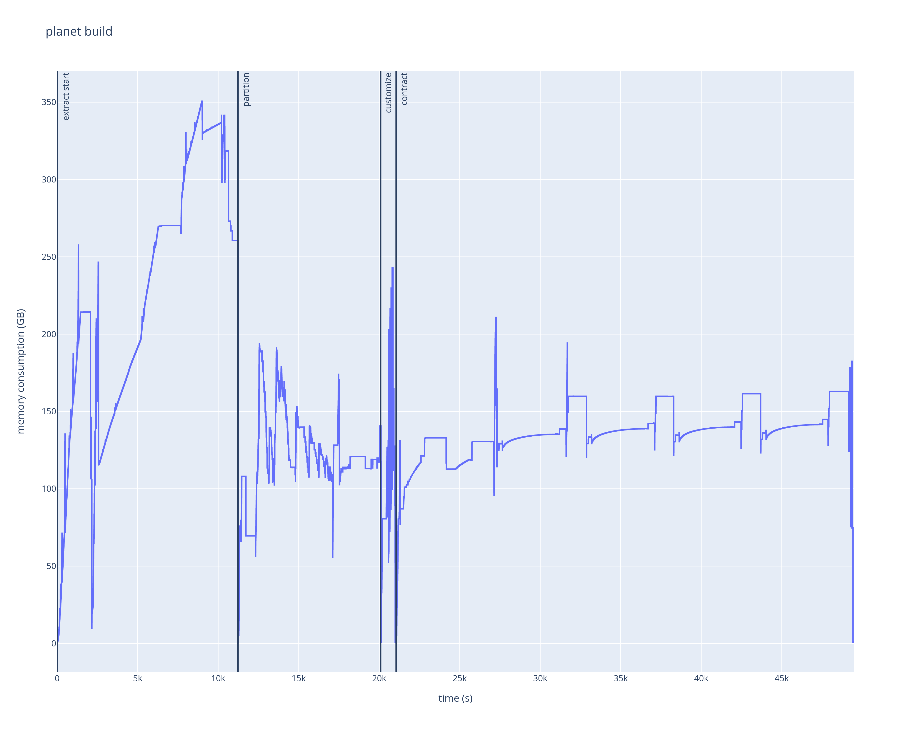

# Building planet for OSRM

## Summary

- OSRM: v5.27.0
- Hardware: Amazon AWS EC2 **r5d.16xlarge**
- Planet file: planet-211018.osm.pbf
- Build steps (full script [here](planet-build.sh)):

  ```bash
  docker run --rm -t -v "/mnt/data1/planet:/data" osrm/osrm-backend osrm-extract -p /opt/car.lua /data/planet-211018.osm.pbf
  docker run --rm -t -v "/mnt/data1/planet:/data" osrm/osrm-backend osrm-partition /data/planet-211018.osm.pbf
  docker run --rm -t -v "/mnt/data1/planet:/data" osrm/osrm-backend osrm-customize /data/planet-211018.osm.pbf
  docker run --rm -t -v "/mnt/data1/planet:/data" osrm/osrm-backend osrm-contract /data/planet-211018.osrm
  ```

## Statistics summary

- _extract_:
  - Peak RAM usage: 374714064896 bytes
  - Walltime: 187m6.449s
- _partition_:
  - Peak RAM usage: 206655406080 bytes
  - Walltime: 147m42.290s
- _customize_:
  - Peak RAM usage: 259521667072 bytes
  - Walltime: 16m1.305s
- _contract_:
  - Peak RAM usage: 224867725312 bytes
  - Walltime: 473m30.413s
- disk space used by files (from all stages): 398GB

## Plot

Memory (RAM) consumption of EC2 instance over time (including OS, etc. - stock memory usage: ~1GB):



Find the full/interactive memory plot [here](https://merschformann.github.io/random/content/plots/osrm/planet-build.html).

## Log

Full log of the build process lives [here](planet-build.log).
